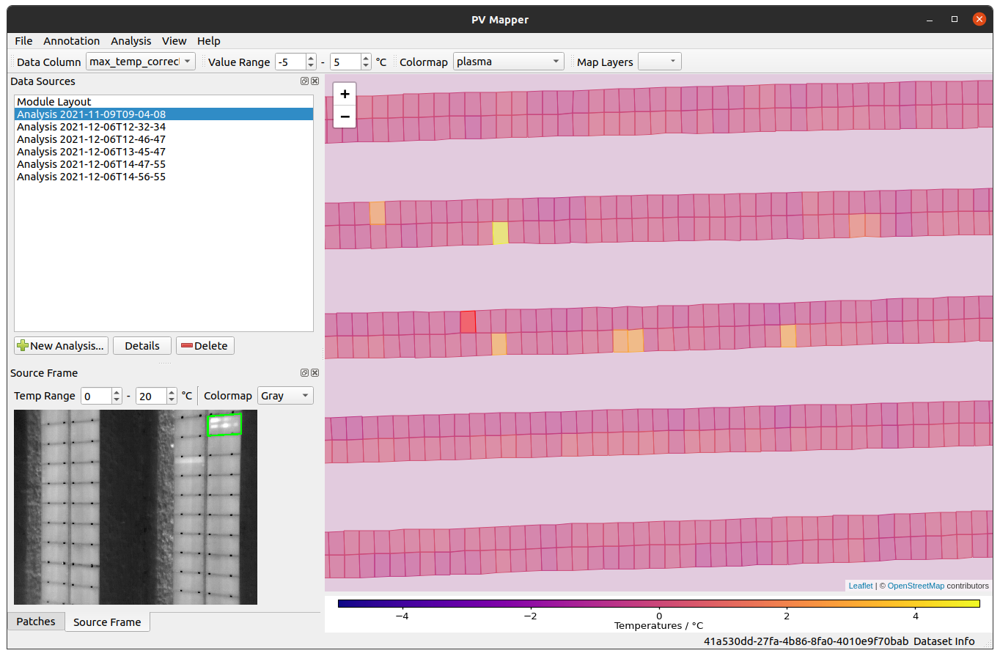
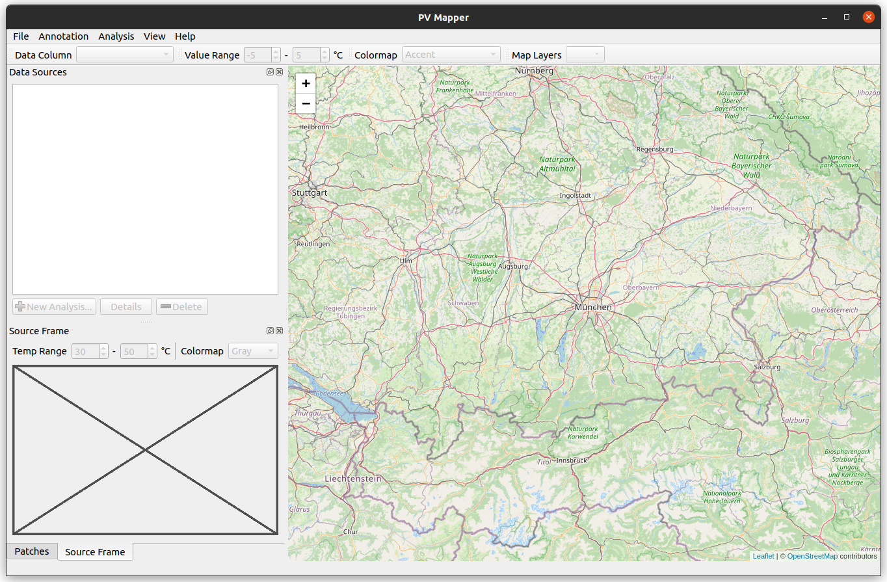
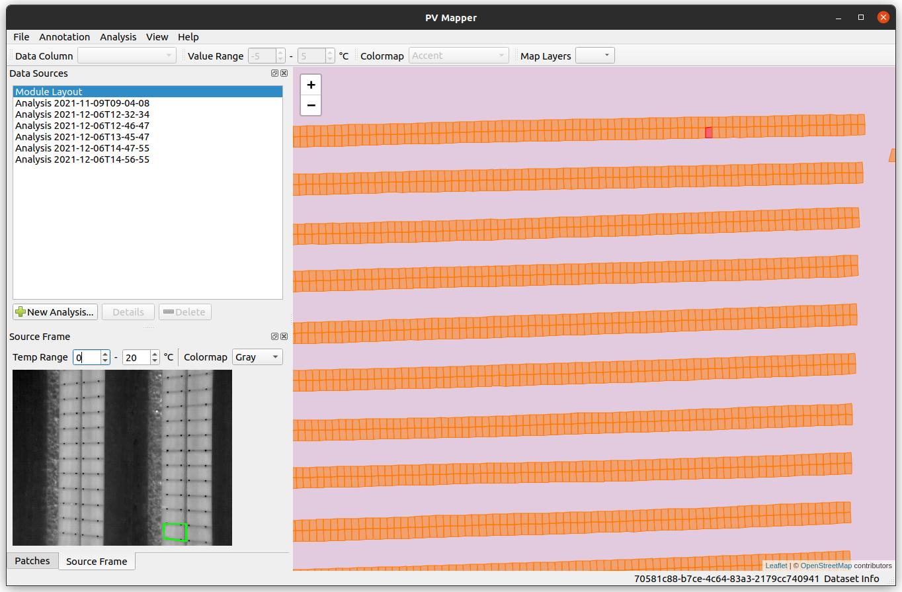
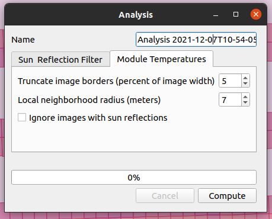
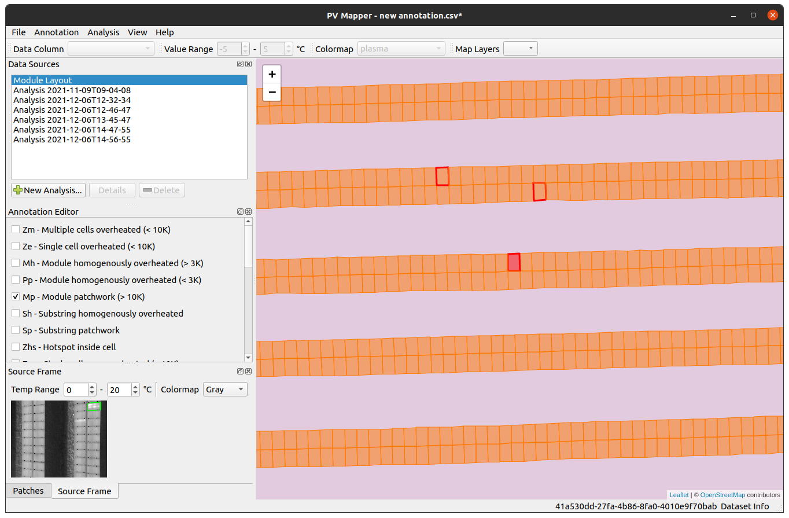
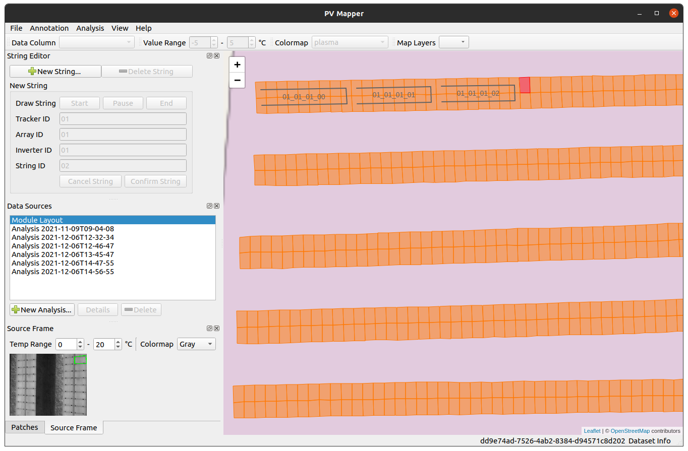

# Dataset Viewer for PV Drone Inspect

This is a desktop app for viewing and analyzing maps of large-scale photovoltaic (PV) plants created with [PV Drone Inspect](https://github.com/LukasBommes/PV-Drone-Inspect).

The following functionality is provided in this app:
- Visualize
- Browse 
- Analyze defects ()
- Visualize defects on the map
- Annotate defects
- Annotate strings




## Installation

We provide prebuild binaries for Ubuntu (x86_64). Download the zip archive from [here]() and extract it to the desired location. Start the terminal in the extracted archive and run the dataset viewer with
```
./main
```

If you want to use the dataset viewer on Windows or you have a different Linux distribution, please see the [instructions below](#build-from-source) on how to build the app from source code.

## Quickstart

After startup the app shows an empty map.



### Opening a dataset

First, you have to open a PV Drone Inspect dataset by clicking *File -> Open Dataset...* (An example dataset can be dowbloaded from [here]()). When the dataset is loaded correctly the map updates and shows a map of the PV plant. You can click individual PV modules and the app will retrieve all image patches of that module as well as the video frame of which the first patch was extracted.



### Performing an analysis on the data

The app provides some analyzes that can be performed on the dataset. To this end, click *Analysis -> New Analysis...* The window below will open. Here, you can select which analysis to perform. You can set the hyper parameters and run the analysis by clicking *Compute*.



Once the analysis is completed, you will find an entry in the *Data Sources* list. When you click on this entry, the map will update and show the analysis results, e.g. temperatures of the PV modules as shown below.


### Annotating module defects

Manual annotation of module defects. You can provide your own annotation scheme by editing the existing scheme in `src/resources/defect_schema.json`. 



Manual annotation of string connectivity of the individual PV modules.

### Annotationing electrical connectivity




## Build from Source

Install prerequisites
- [Python 3.x](https://www.python.org/downloads/)
- [QT](https://www.qt.io/download-qt-installer)

Use Python pip to install the following packages

- PySide6 (pip)
- cx_Freeze (pi)

clone repo

```
git clone https://github.com/LukasBommes/PV-Drone-Inspect
```


```
python setup.py build
```


```
./main
```


Built with
- [Python]()
- [Qt for Python]()
- [Leaflet.js]()


## About

This software is written by Lukas Bommes, M.Sc. - [Helmholtz Institute Erlangen-Nürnberg for Renewable Energy (HI ERN)](https://www.hi-ern.de/hi-ern/EN/home.html)

### License

This project is licensed under the MIT License - see the [LICENSE](https://github.com/LukasBommes/PV-Drone-Inspect-Viewer/blob/master/LICENSE) file for details.

### Citation

If you use PV Drone Inspect or the Dataset Viewer for PV Drone Inspect in your research please consider citing our works listed [here](https://github.com/LukasBommes/PV-Drone-Inspect#citation).